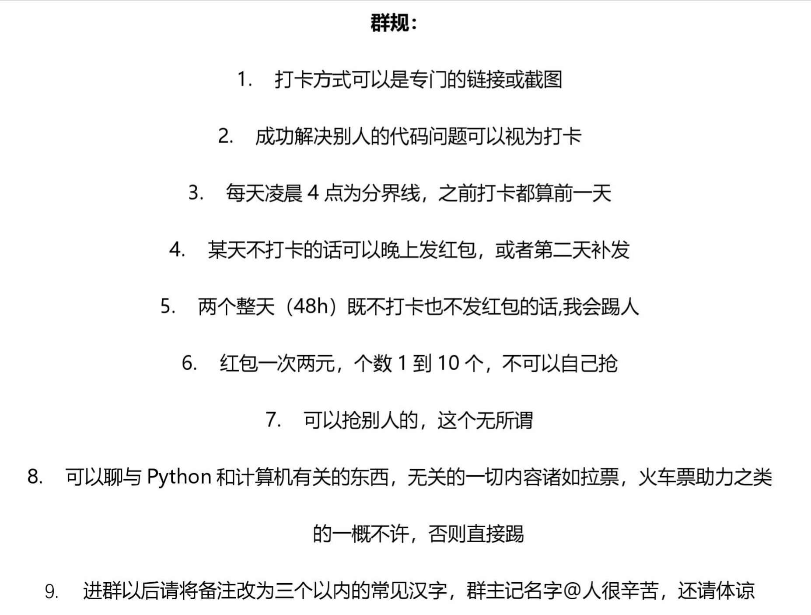

# clubs_and_hometown_groups
软微各种老乡群和各种兴趣群

# 索引

兴趣群
- <a href="#football">足球群</a>
- <a href="#py">Python监督&讨论</a>
- <a href="#basket">篮球群</a>
- <a href="#climb">骑行爬山群</a>

老乡群
- <a href="#hn">湖南老乡群</a>
- <a href="#js">江苏老乡群</a>
- <a href="#sx">山西老乡群</a>
- <a href="#sx2">陕西2019老乡群</a>
- <a href="#tj">天津老乡群</a>
- <a href="#zj">浙江2019老乡群</a>

## 兴趣群
### <a name="football">足球群</a>  

### <a name="py">Python监督&讨论</a>  

	
	

### <a name="basket">篮球群</a>  

### <a name="climb">骑行爬山群</a>  

## 老乡群

### <a name="hn">湖南老乡群</a>  

### <a name="js">江苏老乡群</a>  

### <a name="sx">山西老乡群</a>  

### <a name="sx2">陕西2019老乡群</a>  

### <a name="tj">天津老乡群</a>  

### <a name="zj">浙江2019老乡群</a>  

