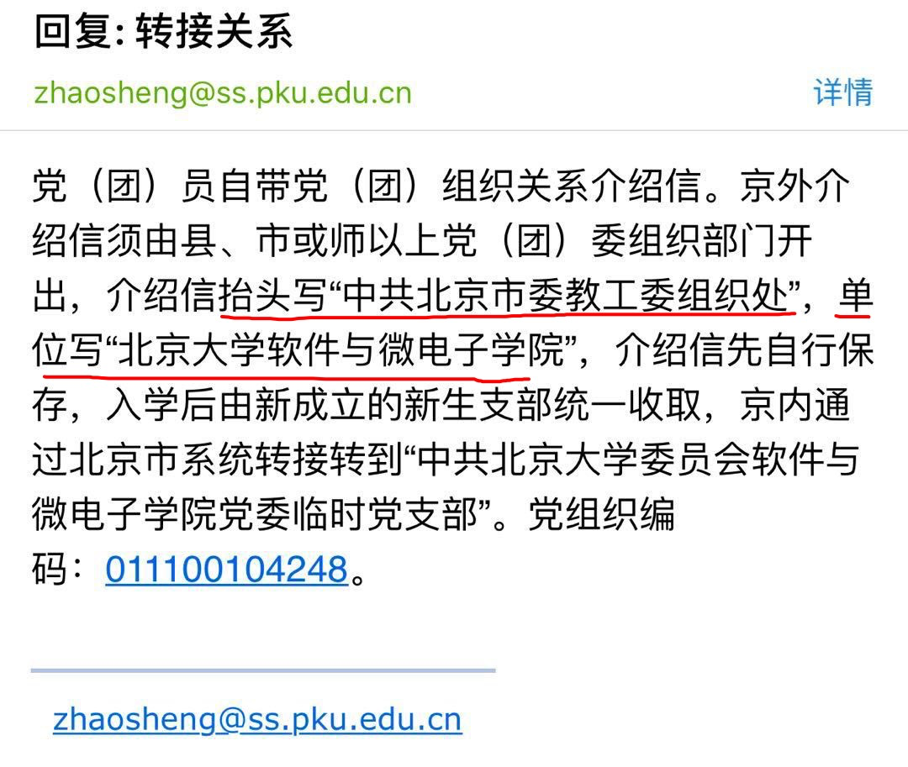

# 转党组织详情

# 转团关系详情
关于转团关系, 甚至是官方给的资料都口径不一.  
摘录一段: 党团关系需要转入北京大学的, 介绍信由县市或以上党(团)委组织部开出介绍信.  
抬头写中共北京市委教工委组织处(北京市党员可以写北京大学党委组织部),团组织写"共青团北京大学委员会". 入学后再交给学院党委或者团委. 
在新生群里, 有经验的学长和在学生办公室的学长告诉我们: 
如果你是团员, 团员资料都在档案袋里, 会跟着档案一起过来.  
群里也有同级同学说了, 现在团组织可以在网上转, 有专门的系统, 不再需要介绍信了.  
介绍信要指明转入的团支部, 而19级的团支部还没有成立. 所以只能开学再转.  
总结: 现在转团只能在开学转, 资料已经跟着档案过来了. 不需要介绍信.  
不确定的可以自己去联系本校的老师和软微的老师. 联系方式应该都能自己找到.    
PS: 搜集群里的信息的新技能已经GET, 正确的历史记录关键词搜索很重要.  

## 关于智慧团建
　　同学你好，根据团中央基层建设部通知：对于升学的毕业学生团员，应该严格按照通知的要求，从9月起由录取学校团组织在新生入学一个月内建立相应团组织，不得在升学团员尚未报到前进行相关操作。现将申请退回，相关工作请九月后再次申请。 

# 转团党组织模板

